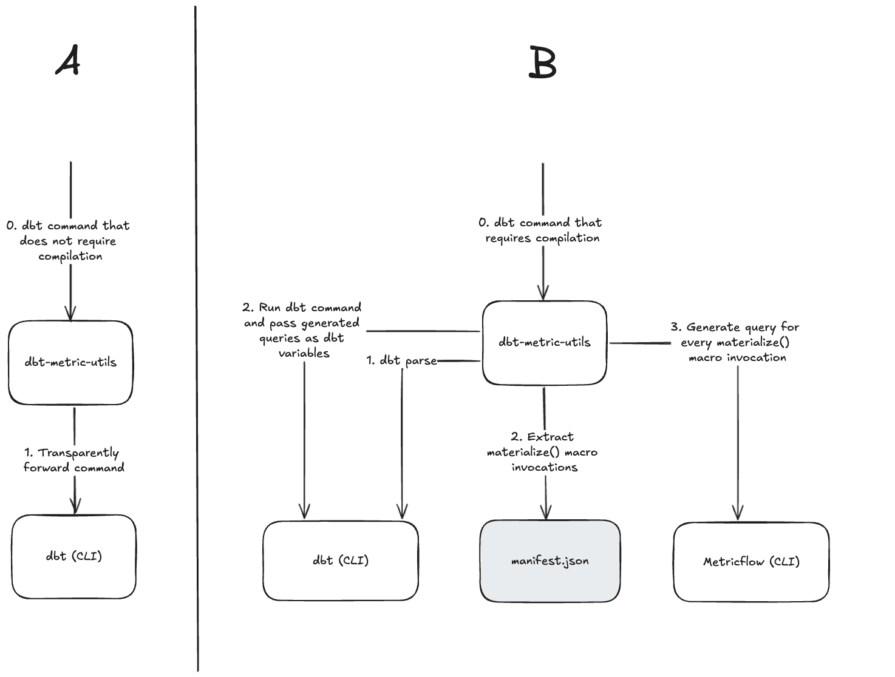

# dbt-metric-utils

This tool allows you to query metrics from your dbt semantic model directly from a dbt model through the `dbt_metric_utils_materialize` macro. One way to look at it is that it revives the `metric.calculate()` macro from dbt `<=v1.5`. By having access to this macro, the dbt semantic layer becomes more useful for dbt-core users. You still don't have all the goodness of dbt-cloud semantic layer but it does allow you to get started with connecting your users and BI tools to aggregation tables/views that are directly querying your metrics.

> [!TIP]
> Check out some examples queries [here](./jaffle-shop/models/marts/materialized_metrics/)

> [!TIP]
> Browse the dbt docs pages for the example project [here](https://djlemkes.github.io/dbt-metric-utils)

## Installation instructions

This project is a Python package that wraps around `dbt` in the most transparant way I could find. Try it out through the following steps:

1. Install `dbt-metric-utils` from Pypi in your project (e.g. `pip install dbt-metric-utils`)
1. Run `dbt-metric-utils init` or `dbtmu init`. This will install the macro into your project and will make sure that any `dbt` CLI calls are intercepted and processed in the correct way (check below for explanation)
1. Introduce a dbt model that calls the `dbt_metric_utils_materialize` macro.
1. Continue using `dbt` as you're used to.

## How it works

Any dbt command that doesn't require dbt to compile your project is simply passed directly to dbt (Mode A in the diagram). A dbt invocation that does require compilation (e.g. `compile`, `run`, `test` , etc) is intercepted by the package.

After intercepting we run through the following sequence of steps

1. Call `dbt parse` . This will build a partially filled `manifest.json` from which we can extract all the models, their dependencies, and the raw SQL queries.
2. Extract all models that contain a `dbt_metric_utils_materialize` invocation.
3. Run `mf query --explain` commands for all the `dbt_metric_utils_materialize` invocations.
4. Inject the generated queries by Metricflow as dbt variables in the actual dbt command. If the user ran `dbt run` , we actually trigger `dbt run --vars {<macro_invocation_signature>: <query>}` 

The passed variables will be a mapping from `dbt_metric_utils_materialize` invocation signature (e.g. `metric=['m1'],dimensions='[dim1']...` ) to the generated metric query. The  `dbt_metric_utils_materialize` macro will find that variable at compile time and return it as the macro result. 

Along this sequence of steps, we also ensure that the dependency graph in `manifest.json` is updated correctly. Dbt itself only detects dependencies based on `ref` and `source` , not on macros that are external to it.

## Code level description

We describe here some details of how the code is used to achieve the steps described above.

### Initialisation
You'll run `dbtmu init` (or `dbt-metric-utils init`) once, which wil:
1. Add dbt_metric_utils_marterialize.sql to macros/, which are the macros used by dbt at compile time (like all regular macros)
2. Replace the dbt script in bin/ with a dbt-metric-utils version, which is identical except for importing `from dbt_metric_utils.cli import cli` instead of `from dbt.main import main`. This will reroute all dbt calls to the dbt-metric-utils CLI, instead of dbt.

### At run-time

When you call any `dbt ...` command, this calls the dbt-metric-utils CLI (as described above)

If the subcommand requires MetricFlow compilation (e.g. compile, run, test etc), then:
1. We call `manifest, metric_query_as_vars = get_metric_queries_as_dbt_vars(target)` to generate an updated manifest (with the model -> metric dependencies) and the rendered SQL calculating the metrics, by:
   1. We parse the dbt project to find all models which call `dbt_metric_utils_materialize` (which uses `dbtRunner().invoke(["parse"])`)
   1. For each `dbt_metric_utils_materialize(...)` invocation, we call the function through `exec`, which renders the code using `dbt_metricflow.cli.cli_context.CLIContext().explain(...).rendered_sql_without_descriptions.sql_query`
   1. The rendered SQL is stored as values in a dictionary, where the key is the call syntax
   1. We update the manifest to include dependencies between these models and the metrics
1. Then, dbt is run (using `dbtRunner(manifest=manifest`).invoke(.., "--vars", yaml.dump(vars_dict)), passing the dict of rendered SQL as a yaml dump to the `--vars` argument
1. When the macro is reached in dbt compile, the macro looks for the rendered sql in the `--vars` argument, and writes this into the query

If the command doesn't require MetricFlow compilation, dbt is called using the Python integration (`res = dbtRunner().invoke(_args)`)

## Key future-proofing considerations

There is of course a risk that something changes in a future dbt version which breaks dbt-metric-utils. Below is a list of assumptions/requirements for the integration, so that we can make a sensible decision on:
1. Whether this should automatically work for future dbt versions
2. If not, how complex it would be to maintain
3. How likely it is to be impossible to make it compatible with future versions

The following dbt interfaces/features are used by dbt-metric-utils:
1. Functionality like `dbt parse` to get the manifest (invoked through `dbtRunner().invoke(...)`)
1. Functionality like `mf query --explain` (invoked through `mf_query = dbt_metricflow.cli.cli_context.CLIContext().mf.explain(MetricFlowQueryRequest.create_with_random_request_id()).rendered_sql_without_descriptions.sql_query`
1. Being able to invoke dbt with something like `dbtRunner(manifest=manifest).invoke(["command", *args, "--vars", ...])`. Critically, we need to pass in an updated manifest and custom vars.

Since 1 and 2 could also be retrieved from a commandline call, even if the Python dbt interface changes, we'd still have a way to upgrade this repo
If 3 changed (e.g. not being able to pass a manifest (possible) or vars (unlikely), we'd have more of a challenge, since there isn't a commandline option for passing the manifest in (as far as I can see)

An option here would be to have a precompilation step, where we physically rewrite the files with the rendered sql (potentially with refs to the metrics or model, to help keep the dependencies)

Overall, I feel it would be fairly easy to update this tool for future dbt versions.